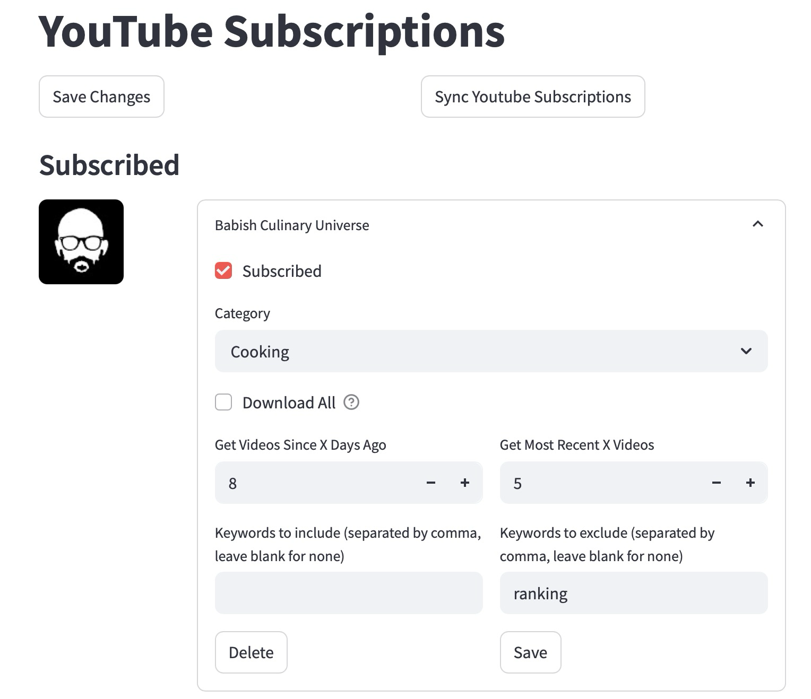
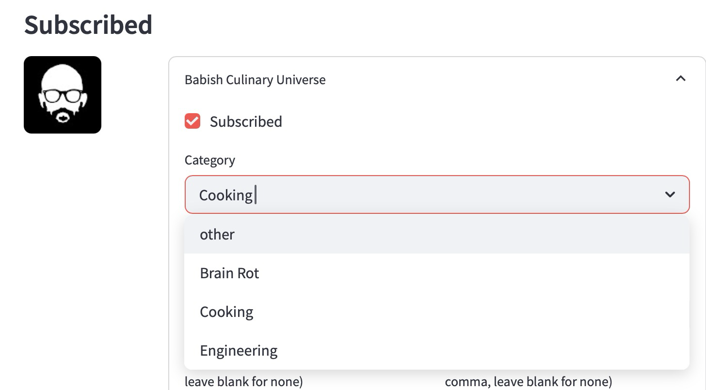
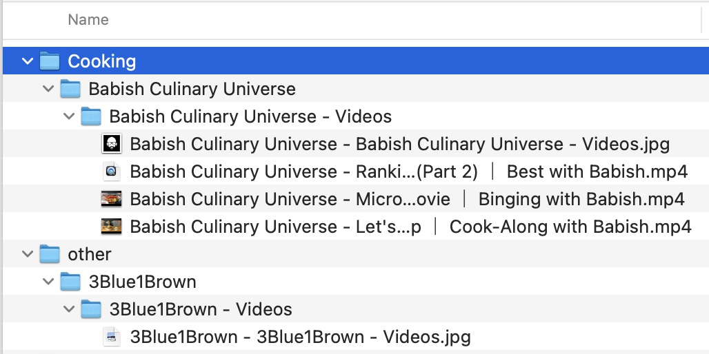
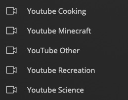
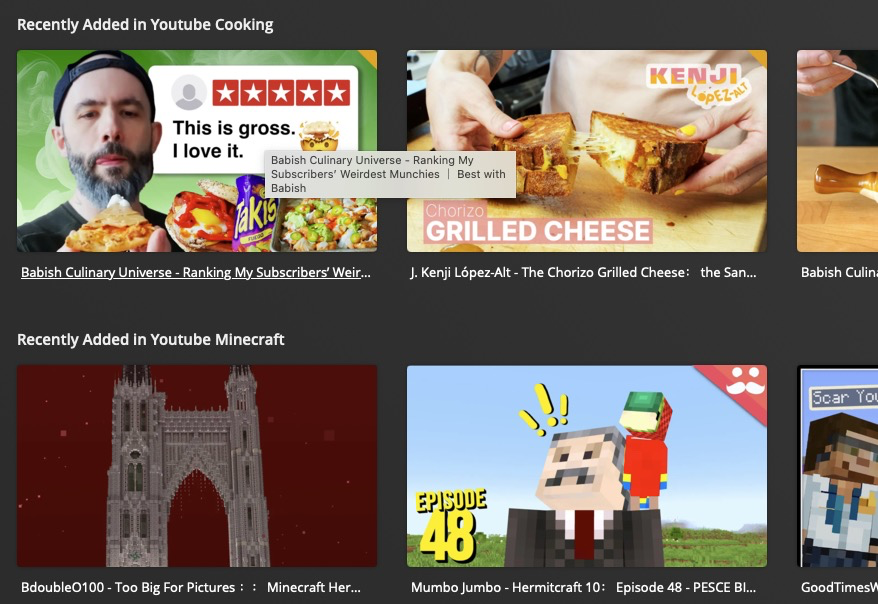

# YouTube Downloader App

This is a YouTube downloader app that can automatically download videos from your subscribed YouTube channels or manually specified channels. You can also manage downloaded content through a web interface built with Python and Streamlit.

## 🚀 In Action

For every channel (either manually added or synced with youtube) control how and when videos can be downloaded.

Use keywords to include or exclude videos by title.



Separate channel downloads into categories with tags. Good for Plex integration (documentation coming soon)




Example Plex setup with categories:



## 🗂️ Installation

### 1. Install Docker & Docker Compose

If you don’t already have Docker installed, please follow the instructions in the official Docker documentation:

- **Docker:** https://docs.docker.com/get-docker/
- **Docker Compose:** https://docs.docker.com/compose/install/

### 2. Clone the Project

Clone the repository to your local machine:

```git clone https://github.com/zpreator/CacheCow.git```
```cd CacheCow```

### 3. Set Up the Docker Environment

Run this setup script to configure the docker environment (it will ask you for your download path and what port to serve the web app)

```bash setup.sh```

This command will build and start all necessary services, including:

- A Streamlit app (for the web interface)
- The YouTube downloader script
- The cleaner script

### 4. Access the Web Interface

Once the app is running, open your browser and navigate to (address or port may be different depending on your setup):

```http://localhost:8501```

OR if accessing from another computer

```http://<local_ip_address>:<port>```

You’ll be able to interact with the app here!

### 5. Set Up Your Configuration

To download content from YouTube, you’ll need to configure the app. Follow the instructions in the [YouTube API Setup Guide](./youtube-api.md) for how to generate your `client_secret.json` and configure OAuth for automatic subscription syncing.

If you prefer not to set up OAuth, you can manually add YouTube channels directly from the web interface.

### 6. Managing Downloads

- Add YouTube channels via the web interface by pasting the channel URL.
- The app will download the latest videos from the added channels and store them in the specified location on your machine.

## ⚙️ How the App Works

This app leverages **yt-dlp**, a command-line tool for downloading videos, and a Streamlit web interface for ease of use.

The app will:
1. Use the YouTube Data API (if configured) to fetch the list of videos from your subscriptions.
2. Download videos with yt-dlp based on your chosen settings.
3. Organize downloaded content by the channel and video name.
4. Provide you with a simple interface to manage, update, and delete channels.

## 📝 Notes

- The first time you run the app, it may ask you to authenticate with Google to access YouTube data. This is optional, and you can manually add channels if preferred.
- You can change the download folder path in the configuration files (as long as it is within the original file path specified during setup).
- To stop the app, use `docker-compose down` to bring down the Docker containers.

## 🛠️ Troubleshooting

If you encounter issues with Docker or Docker Compose, please ensure you have the latest versions installed. You can also refer to the Docker troubleshooting guide here: https://docs.docker.com/config/daemon/

---

Happy downloading! 😊
