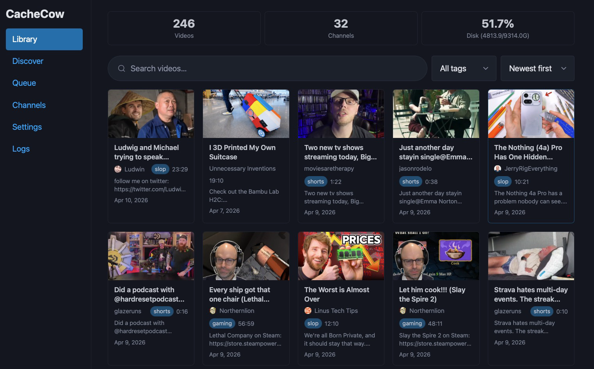
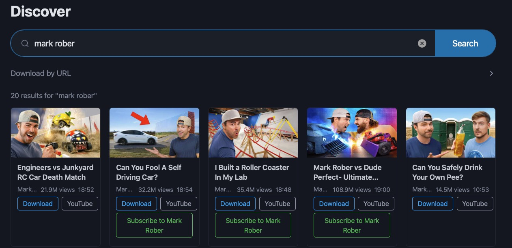
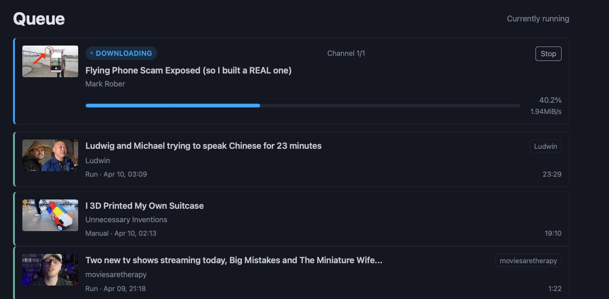
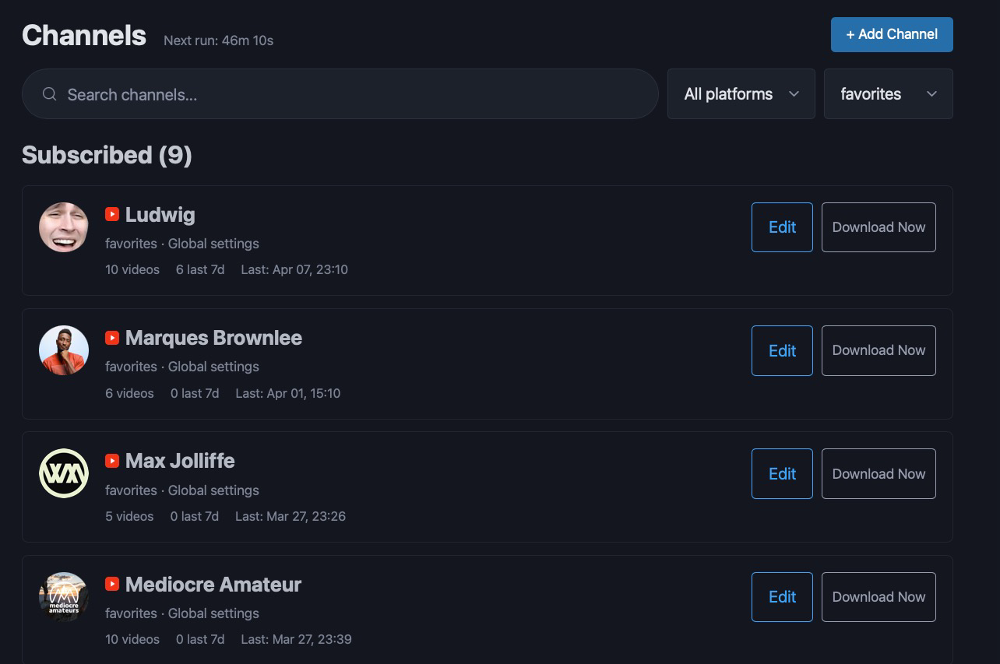
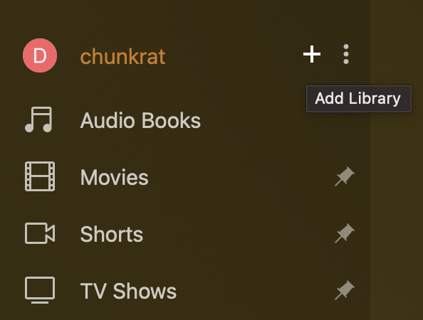
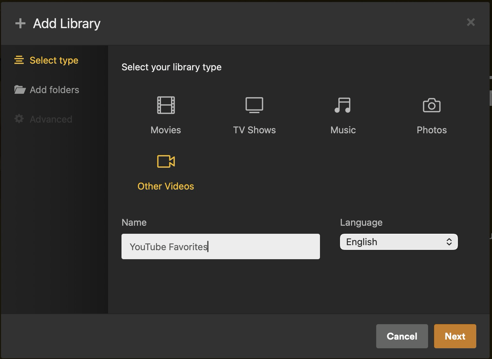
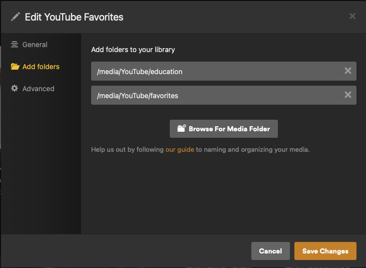

# CacheCow

CacheCow is an app for automatically downloading and watching videos from various platforms. No recommendations, no rabbit holes. Save exactly the videos you want to watch — nothing more, nothing less.

Optionally use another tool like plex or jellyfin to watch the videos anywhere. [Instructions Here](#plex-integration)

I use this app primarily to watch youtube videos on my TV through plex, where plex media server and Cache Cow are both running on a server.

## Installation

Download page: [CacheCow Download Site](https://zpreator.github.io/cachecow/)

### Desktop App (macOS / Windows)

> ⚠️ **Caution:** These apps are not signed and will be blocked by the OS by default. Future updates to the app will allow it, but for now there are workarounds for running them.

For the easiest installation and use.

### Docker

Use this option if you intend to access the application through the browser, or from another machine.
```cmd
curl -sSL https://github.com/zpreator/CacheCow/releases/latest/download/install.sh | bash
```

### Python

You can also run the app without docker by calling python directly. Follow these steps to install and run the backend and use a browser to access the UI.

In command prompt/terminal (run one at a time):
```cmd
git clone https://github.com/zpreator/CacheCow.git
cd CacheCow
python -m venv .venv

# (Mac/Linux)
source .venv/bin/activate
# (Windows)
.venv/Scripts/activate

python -m pip install --upgrade pip
pip install -r requirements.txt
python run.py
```


## Getting Started

To get started, download a video! Search for a video on the discover tab and click 'download'. After that, try setting up a channel which will run automatically at the interval specified in settings.

### Library

Page showing all videos currently downloaded through the app. Searchable by keyword and tags filtering with sorting.



### Discover

Search youtube for specific videos, or use the 'Download by URL' dropdown to download any video on demand. Use the subscribe button to add that channel to your subscribed [channels](#channels)



### Queue

Shows the download status and log of previously downloaded videos



### Channels

Manage your subscribed channels. Use the + Add Channel to add a new channel, edit existing channels.



## Configuration

## Plex Integration

1. In CacheCow, note the download path and ensure the plex server has access to it. In CacheCow go to settings and scroll down to the download path to view it.

2. Optionally use tags to segment media, like 'favorites' or 'gaming', resulting in {download_path}/favorites. Otherwise, the default will be {download_path}/other

3. In plex, select your server and click the plus icon to add a library


4. Select 'Other Videos' and give it a name like 'YouTube Favorites'


5. Add a media path matching your download path from CacheCow. Anything under that path will be scanned


6. Save changes and thats it! Youtube channels you have subscribed to in CacheCow will automatically appear in plex in a dedicated library.

## Future Features

- [ ] Code signing and notarization (macOS & Windows)
